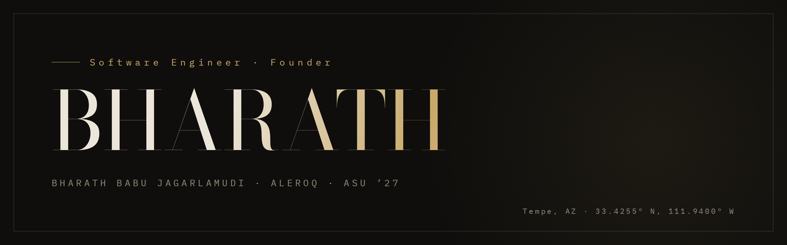
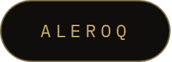
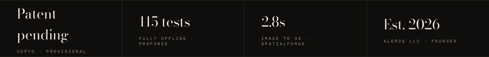
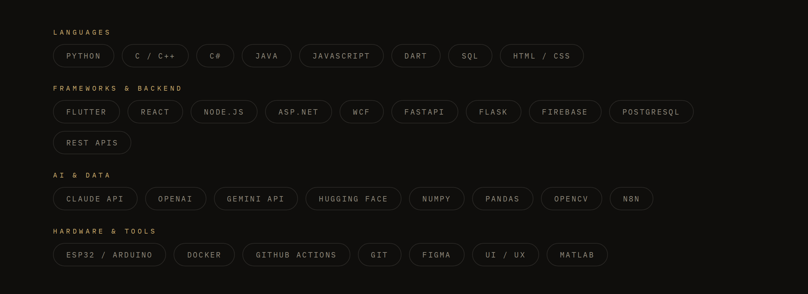

  &nbsp;&nbsp;
  &nbsp;&nbsp;
  
  <!-- Once the portfolio is deployed, add:
  &nbsp;&nbsp;
  -->

I build products end to end: firmware to cloud to the pitch. Founder of **ALEROQ**, where AI reads your car's fault codes and dispatches help before you finish pulling over. B.S. Computer Science at Arizona State, 2027. U.S. work authorized, no sponsorship required.

- Building **ALEROQ Auto**: BLE OBD2 diagnostics, Claude-powered fault analysis, emergency SOS dispatch. Patent pending.
- Grader, Entrepreneurship &amp; Innovation · ASU Fulton
- Senior capstone · CSE 485

| Project | The work | Stack | Where |
|---|---|---|---|
| **ALEROQ Auto** | AI vehicle diagnostics and emergency roadside dispatch. Event-driven Firebase backend, custom BLE GATT layer speaking ELM327, Claude fault analysis in under 2 seconds. | Flutter · Firebase · Node.js · BLE · Claude API | [`aleroq.com`](https://aleroq.com) · patent pending |
| **SpatialForge 3D** | Image and text to 3D on AMD ROCm. Ported a CUDA-only dependency to a CPU marching-cubes path; 2.8s end to end, zero failures across 14 benchmarked assets. | Python · PyTorch · ROCm · NumPy · Gradio | AMD AI DevMaster Hackathon |
| **PRDForge** | Five-agent LangGraph swarm compiling natural-language PRDs into validated RFCs, Firestore schema plans and analyzer-clean Dart. 115 fully offline tests. | LangGraph · Claude API · Pydantic · Dart | Private build · ask me |
| **vmd** | Vectorized Markdown rendering engine, built as a Rust CLI. | Rust | crates.io release in progress |
| **SmartLedger** | AI transaction categorizer benchmarked against a rule engine, with confidence scores and reasoning stored per transaction. | FastAPI · PostgreSQL · React · OpenAI · Docker | [`repo`](https://github.com/Bharathbabu-01/smartledger) |
| **ParkUp** | Smart parking hardware: ESP32 nodes with LiDAR, NFC and LoRa streaming live space data to Firestore. Solo build, sensor to app. | ESP32 · LoRa · Flutter · Firestore | [`db build`](https://github.com/Bharathbabu-01/cse412-database-project) |
| **Systems work** | Linux kernel dm-cache LRU replacement, producer-consumer kernel threads with semaphores, page-table walker with swap handling, compiler IR generation. | C · C++ · Linux kernel | [`dm-cache`](https://github.com/Bharathbabu-01/dm-cache-lru) · [`kthreads`](https://github.com/Bharathbabu-01/linux-kernel-zombie-producer-consumer) · [`vmem`](https://github.com/Bharathbabu-01/linux-virtual-memory-translator) · [`compiler`](https://github.com/Bharathbabu-01/tiny-compiler-ir) |
| **Distributed services** | WCF and REST services in C#, plus a multi-page ASP.NET app with role-based auth deployed to WebStrar. | C# · WCF · REST · ASP.NET | [`services`](https://github.com/Bharathbabu-01/cse445a4) · [`ClubHub`](https://github.com/Bharathbabu-01/Club-Hub) |

- Raised in Hyderabad, building in Tempe.
- I learn by deriving things from scratch; memorization never stuck.
- I would rather hear a hard truth than a comfortable one, and I build the same way.
- Off the clock: Curious about geopolitics, or soldering something that voids a warranty.
- Ask me about teaching a car to explain its own fault codes, getting TripoSG to run on ROCm, or why I filed a patent before my degree.

  &nbsp;&nbsp;
  

  Designed, not templated &nbsp;·&nbsp; Hyderabad &#8594; Tempe &nbsp;·&nbsp; 33.4255° N, 111.9400° W

<!-- Reading the raw markdown? Good instinct. bjagarla@asu.edu -->
